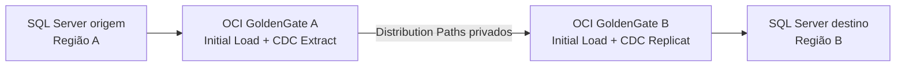

# OCI GoldenGate — SQL Server entre regiões OCI

Runbook para configurar replicação unidirecional de **Microsoft SQL Server de uma região OCI para outra**, usando **OCI GoldenGate**, carga inicial consistente e Change Data Capture (CDC).

> Este documento é um modelo técnico. Substitua todos os valores entre `<...>` e valide-o em homologação antes de produção.

## Arquitetura



O destino é uma réplica de DR: a aplicação não deve gravar nele enquanto a replicação estiver ativa.

## Premissas

- SQL Server de origem e destino são versões/edições compatíveis e usam SQL Server Authentication.
- As tabelas replicadas têm chave primária ou chave única confiável.
- A replicação é unidirecional e de DML (`INSERT`, `UPDATE`, `DELETE`).
- DDL não é replicado nesse fluxo CDC. Mantenha o schema no destino por change control.
- A versão do GoldenGate é 23.8 ou superior para usar *precise instantiation* com `USESNAPSHOT`.

| Item | Exemplo |
|---|---|
| Região de origem | `<sa-saopaulo-1>` |
| Região de destino | `<us-ashburn-1>` |
| Banco de origem | `<APPPRD>` |
| Banco de destino | `<APPDR>` |
| Schema de aplicação | `<dbo>` |
| Schema GoldenGate | `<ggschema>` |
| Extract inicial / CDC | `EIL` / `ECDC` |
| Trail inicial / CDC | `il` / `cd` |
| Replicat inicial / CDC | `RIL` / `RCDC` |

## 1. Rede OCI

1. Crie ou reutilize uma VCN em cada região, com subnets privadas.
2. Crie um DRG em cada região, anexe-o às VCNs e crie uma *Remote Peering Connection* (RPC) em cada DRG.
3. Estabeleça o pareamento remoto e configure rotas recíprocas para os CIDRs privados.
4. Crie deployments OCI GoldenGate com endpoint privado, um em cada região.
5. Nas NSGs/security lists, permita somente:
   - TCP `1433`: GoldenGate A → SQL Server origem;
   - TCP `1433`: GoldenGate B → SQL Server destino;
   - TCP `443`: GoldenGate A ↔ GoldenGate B, para os Distribution Paths;
   - TCP/UDP `53`, se houver DNS privado entre as VCNs.

Use IPs privados. O Remote Peering permite comunicação entre VCNs de regiões distintas sem atravessar a internet pública.

## 2. Vault, secrets e conexões

1. Crie um OCI Vault e secrets para as credenciais `ggext` (origem) e `ggrep` (destino).
2. Garanta permissões IAM para administrar OCI GoldenGate, usar Vault/Secrets e usar a rede necessária.
3. Em **OCI GoldenGate > Connections**, crie duas conexões do tipo **Microsoft SQL Server**:
   - `conn-sqlsrc`: host privado, porta 1433, banco `<APPPRD>`, secret de `ggext`;
   - `conn-sqltgt`: host privado, porta 1433, banco `<APPDR>`, secret de `ggrep`.
4. Associe `conn-sqlsrc` ao deployment da Região A e `conn-sqltgt` ao deployment da Região B.

## 3. Preparar SQL Server de origem

Execute como administrador SQL Server. Use senhas fortes armazenadas apenas no Vault.

```sql
USE master;
GO
CREATE LOGIN ggext WITH PASSWORD = '<senha-forte>';
GO

USE msdb;
GO
CREATE USER ggext FOR LOGIN ggext;
ALTER ROLE SQLAgentReaderRole ADD MEMBER ggext;
GO

USE <APPPRD>;
GO
CREATE USER ggext FOR LOGIN ggext;
CREATE SCHEMA ggschema AUTHORIZATION ggext;
ALTER ROLE db_owner ADD MEMBER ggext;
GO
```

Habilite CDC usando uma conta `sysadmin`:

```sql
USE <APPPRD>;
GO
EXEC sys.sp_cdc_enable_db;
GO

EXEC sys.sp_cdc_help_jobs;
SELECT name, is_cdc_enabled
FROM sys.databases
WHERE name = '<APPPRD>';
```

Confirme que o **SQL Server Agent** e os jobs CDC estão ativos. O privilégio `sysadmin` é necessário somente se a conta GoldenGate for habilitar o CDC; prefira que um DBA o habilite e mantenha a conta de Extract com o menor privilégio possível.

## 4. Preparar SQL Server de destino

Crie o banco, schemas e objetos da aplicação no destino antes de iniciar a entrega. Em seguida:

```sql
USE master;
GO
CREATE LOGIN ggrep WITH PASSWORD = '<senha-forte>';
GO

USE <APPDR>;
GO
CREATE USER ggrep FOR LOGIN ggrep;
CREATE SCHEMA ggschema AUTHORIZATION ggrep;
ALTER ROLE db_owner ADD MEMBER ggrep;
GO
```

No deployment GoldenGate da Região B:

1. Abra **DB Connections** e conecte no SQL Server destino.
2. Crie a checkpoint table `ggschema.GGCHKPT`.
3. Crie uma heartbeat table, se disponível, para medir o atraso ponta a ponta.

## 5. Habilitar TRANDATA e retenção CDC

No deployment da Região A:

1. Abra **DB Connections > TRANDATA** na conexão source.
2. Adicione todas as tabelas replicadas, por exemplo `dbo.Cliente`, `dbo.Pedido` e `dbo.ItemPedido`.
3. Verifique que `ADD TRANDATA` concluiu antes de iniciar a carga inicial.
4. Crie a tarefa **Purge Change Data** no Web UI do GoldenGate.

> Não permita que a limpeza padrão do CDC remova dados ainda não capturados pelo Extract. Dimensione a retenção considerando o maior tempo de indisponibilidade esperado e a taxa de alterações.

## 6. Carga inicial consistente

No banco source:

```sql
ALTER DATABASE <APPPRD> SET ALLOW_SNAPSHOT_ISOLATION ON;
GO
```

No deployment da Região A:

1. Crie um **Initial Load Extract** chamado `EIL`, com trail `il` e alias da conexão source.
2. Configure o parâmetro:

   ```text
   INITIALLOADOPTIONS USESNAPSHOT
   TABLE dbo.Cliente;
   TABLE dbo.Pedido;
   TABLE dbo.ItemPedido;
   ```

3. Inicie `EIL` e aguarde sua finalização normal.
4. No report do Extract, registre o LSN consistente exibido em uma mensagem `OGG-05381`/`OGG-05379`.

Esse LSN é o ponto de início do CDC e evita lacunas ou duplicidades entre carga inicial e replicação contínua.

## 7. Distribution Paths entre regiões

No deployment da Região B:

1. Crie um usuário GoldenGate com role `Operator` para a comunicação entre deployments, ou configure OAuth quando ambos forem IAM-enabled.

No deployment da Região A:

1. Crie a credencial/path connection para esse usuário.
2. Crie e inicie dois Distribution Paths:
   - `PIL`: origem `EIL`, trail `il`;
   - `PCD`: origem `ECDC`, trail `cd`.
3. Marque os dois paths como **Critical** e habilite **Auto Restart**.

## 8. Aplicar a carga inicial

No deployment da Região B:

1. Crie o Replicat inicial `RIL`, com origem no trail `il`.
2. Selecione o alias do banco destino e a checkpoint table `ggschema.GGCHKPT`.
3. Use o mapeamento:

   ```text
   MAP dbo.Cliente, TARGET dbo.Cliente;
   MAP dbo.Pedido, TARGET dbo.Pedido;
   MAP dbo.ItemPedido, TARGET dbo.ItemPedido;
   ```

4. Inicie `RIL` e aguarde o encerramento normal.
5. Valide report, número de linhas e erros antes de prosseguir.

## 9. Criar e iniciar CDC

Na Região A:

1. Crie um **Change Data Capture Extract** `ECDC`, trail `cd`.
2. Posicione-o no LSN registrado no report de `EIL`.
3. Configure as mesmas tabelas do Extract inicial.
4. Habilite **Auto Start** e **Auto Restart**.

Na Região B:

1. Crie o Replicat CDC `RCDC`, com origem no trail `cd`.
2. Selecione o alias do destino e a checkpoint table `ggschema.GGCHKPT`.
3. Use o mesmo conjunto de regras `MAP`.
4. Habilite **Auto Start** e **Auto Restart**.
5. Inicie `ECDC` e depois `RCDC`.

Se snapshot isolation não era usado antes, desligue-o somente depois de confirmar que o CDC está saudável:

```sql
ALTER DATABASE <APPPRD> SET ALLOW_SNAPSHOT_ISOLATION OFF;
GO
```

## 10. Validação de homologação

Teste `INSERT`, `UPDATE` e `DELETE` em tabelas piloto. Só libere produção após validar:

- `ECDC`, `PCD` e `RCDC` em estado `RUNNING`;
- lag próximo do RPO definido;
- contagens de linhas e totais de negócio equivalentes;
- transações grandes, LOBs e caracteres especiais;
- reinício do Replicat e retomada pelo checkpoint;
- indisponibilidade de rede breve e recuperação automática;
- espaço das tabelas CDC e storage do GoldenGate.

## 11. Operação e DR

Monitore lag de Extract, Distribution Path e Replicat, falhas de processos, checkpoint, SQL Server Agent, jobs CDC, espaço em disco e heartbeat.

Em desastre real:

1. Faça *fencing* do source para evitar escrita dupla.
2. Registre o último checkpoint e o lag conhecido.
3. Promova o banco da Região B para atender a aplicação.
4. Reaponte o endpoint da aplicação.
5. Para retorno à Região A, faça reconciliação e configure a topologia reversa antes de reabrir escrita no site original.

GoldenGate mantém dados replicados, mas não promove automaticamente o SQL Server nem altera o endpoint da aplicação. O plano de DR deve definir RPO, RTO, responsáveis e critérios de acionamento.

## Referências

- [OCI GoldenGate: conexão com Microsoft SQL Server](https://docs.oracle.com/en/cloud/paas/goldengate-service/qodtl/)
- [Privilégios Oracle GoldenGate para SQL Server](https://docs.oracle.com/en/database/goldengate/core/26/coredoc/prepare-database-users-and-privileges-oracle-goldengate-processes-sql-server.html)
- [Preparação CDC e TRANDATA](https://docs.oracle.com/en/database/goldengate/core/26/coredoc/prepare-preparing-database-oracle-goldengate-cdc-capture.html)
- [Precise instantiation para SQL Server](https://docs.oracle.com/en/database/goldengate/core/26/coredoc/instantiate-precise-instantiation-sql-server.html)
- [Criar Distribution Path](https://docs.oracle.com/en/cloud/paas/goldengate-service/ocigg/replicate/add-a-distribution-path.html)
- [Remote VCN Peering na OCI](https://docs.oracle.com/en-us/iaas/Content/Network/Tasks/VCNpeering.htm)
